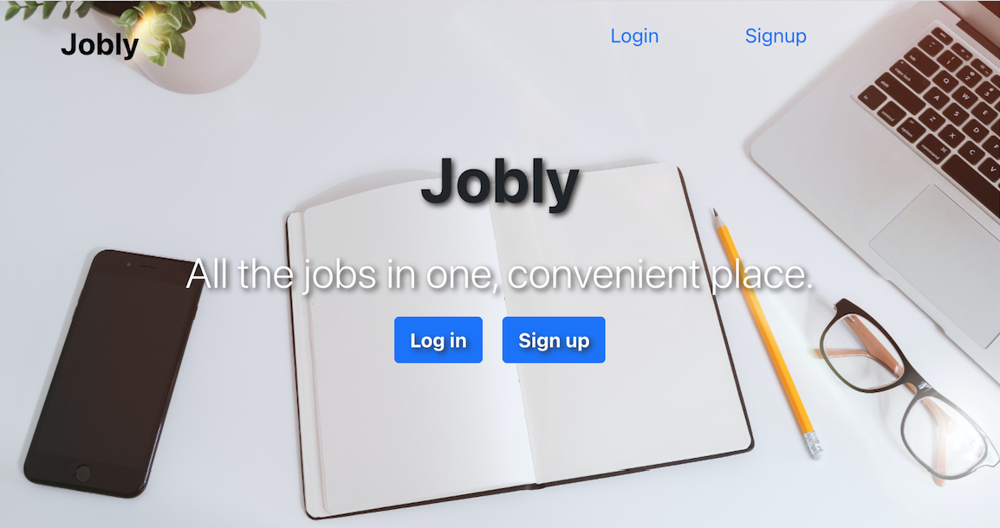

## Jobly - The Front End
*An online job board project completed with user authentication, company and job searching functionality.*

Jobly is a responsive single page React web application for job searching.
  - Users need authentication by registering or logging in to reach the private routes. Once they log in, they are greeted by a personalized welcome message on the home page.
  - Users could browse all jobs by job titles or company name, they could also search companies by company names. 
  - Users can update their profile.

## Check out my [live demo](http://jobly.demo.lidanhuang.com/)!

---
## Installation and Setup
`npm install` 
Installs project dependencies

`npm start` 
Runs the app in the development mode 
Opens [http://localhost:3000](http://localhost:3000) to view in the browser

`npm test` 
Launches the tests for components 
*Tests currently WIP

---
## Technology Notes
  - Built with React via [create-react-app](https://create-react-app.dev/)
  - Styled with [Bootstrap](https://getbootstrap.com/docs/5.1/getting-started/introduction/)
  - [Axios](https://www.npmjs.com/package/axios) is used to make API requests.
  - [jwt-decode](https://www.npmjs.com/package/jwt-decode) is used to decode user's username from the token once the user is authenticated.
